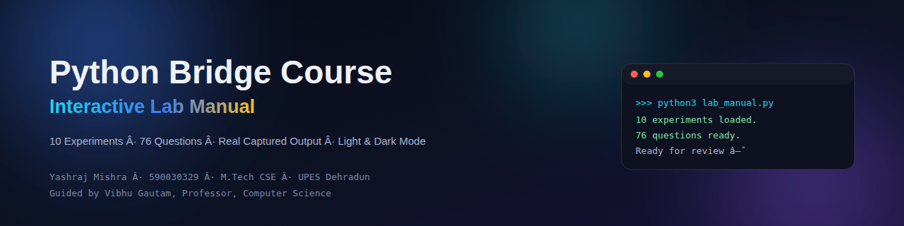

<p align="center">
  
</p>

<h1 align="center">Python Bridge Course — Interactive Lab Manual</h1>

<p align="center">
  A glassmorphism-styled, searchable, light/dark, printable website built from a
  10-experiment Python lab assessment notebook.
</p>

<p align="center">
  <a href="https://github.com/YashrajMishra6190/UPES_PG_590030329"></a>
  
  
</p>

---

## 📖 Project Description

This repository turns a Jupyter notebook of 10 Python lab experiments — installation
and syntax through data analysis and visualization — into a fully static, interactive
reference site. Every question, explanation, code snippet, real captured output,
dataframe table, and chart from the original notebook is rendered as a searchable,
navigable web page, alongside the notebook itself and a PDF of the accompanying
handwritten lab notes.

**Highlights**
- 10 experiments · 76 questions · real captured code output (not just static text)
- Light / dark mode with saved preference
- Live search that highlights matching keywords inline, across every chapter
- One-click **Print / Save as PDF** with a dedicated print layout
- Handwritten notes available to view in-page or download as PDF
- Scrollspy sidebar navigation, copy-to-clipboard code blocks, syntax highlighting
- Fully static — no backend, deployable directly on GitHub Pages

---

## 👤 Student Information

| | |
|---|---|
| **Student Name** | Yashraj Mishra |
| **SAP ID / Global ID** | 590030329 |
| **Course** | M.Tech Computer Science and Engineering |
| **Guided By** | Vibhu Gautam — Professor, Computer Science, UPES Dehradun |
| **GitHub** | [github.com/YashrajMishra6190](https://github.com/YashrajMishra6190) |

---

## 🗂️ Repository Structure

Main repository: **[UPES_PG_590030329](https://github.com/YashrajMishra6190/UPES_PG_590030329)**

All files for this piece of coursework live under:

```
UPES_PG_590030329/
└── Project/
    └── Python Assessment/
        ├── index.html              # website entry point
        ├── css/
        │   └── style.css           # design system, light/dark theme, print stylesheet
        ├── js/
        │   ├── data.js             # notebook content, pre-parsed into JSON
        │   └── app.js              # rendering + interactivity
        ├── assets/
        │   ├── handwritten.pdf     # scanned handwritten lab notes
        │   └── img/
        │       ├── bar_chart.png
        │       ├── line_chart.png
        │       ├── pie_chart.png
        │       └── scatter_chart.png
        ├── requirements.txt        # Python packages used in the notebook
        ├── 590030329_Py_Assessment.ipynb   # the original lab notebook
        └── README.md
```

### Running the notebook

```bash
cd "Project/Python Assessment"
pip install -r requirements.txt
jupyter notebook 590030329_Py_Assessment.ipynb
```

### Running the website locally

No build step — it's plain HTML/CSS/JS.

```bash
cd "Project/Python Assessment"
python3 -m http.server 8000
# then open http://localhost:8000
```

### Deploying to GitHub Pages

1. Push this repository (or just the `Python Assessment` folder as its own repo)
   to GitHub.
2. **Settings → Pages → Source → Deploy from a branch**, pick the branch and the
   folder containing `index.html` (root, or `/Project/Python Assessment` if using
   GitHub's folder-based Pages source).
3. The site goes live at `https://<username>.github.io/<repo>/` within a minute.

> **Note:** replace `assets/handwritten.pdf` with your actual scanned notes
> (same filename) before publishing — a placeholder ships in its place.

---

## 📄 License

This project is licensed under the [MIT License](LICENSE) — see the `LICENSE`
file for the full text. In short: free to use, copy, modify, and distribute,
with attribution and no warranty.

---

<p align="center">Built with ❤️ by <a href="https://github.com/YashrajMishra6190">Yashraj Mishra</a>, guided by <a href="https://github.com/vibhug0077">Vibhu Gautam</a></p>
